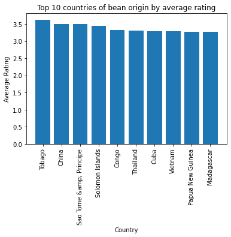
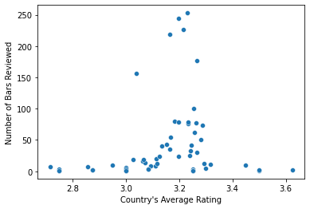
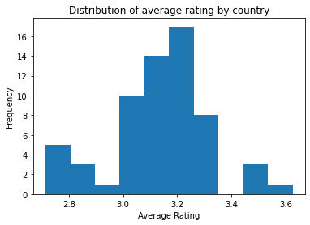
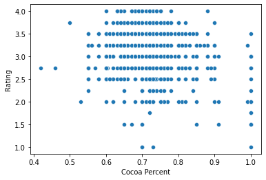
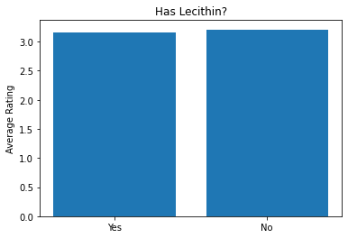

# Finding the best chocolate bars

## 📖 Background
You work at a specialty foods import company that wants to expand into gourmet chocolate bars. Your boss needs your team to research this market to inform your initial approach to potential suppliers.

After finding valuable chocolate bar ratings online, you need to explore if the chocolate bars with the highest ratings share any characteristics that could help you narrow your search for suppliers (e.g., cacao percentage, bean country of origin, etc.)

## 💾 The data

#### Your team created a file with the following information ([source](https://flavorsofcacao.com)):
- "id" - id number of the review
- "manufacturer" - Name of the bar manufacturer
- "company_location" - Location of the manufacturer
- "year_reviewed" - From 2006 to 2021
- "bean_origin" - Country of origin of the cacao beans
- "bar_name" - Name of the chocolate bar
- "cocoa_percent" - Cocoa content of the bar (%)
- "num_ingredients" - Number of ingredients
- "ingredients" - B (Beans), S (Sugar), S* (Sweetener other than sugar or beet sugar), C (Cocoa Butter), (V) Vanilla, (L) Lecithin, (Sa) Salt
- "review" - Summary of most memorable characteristics of the chocolate bar
- "rating" - 1.0-1.9 Unpleasant, 2.0-2.9 Disappointing, 3.0-3.49 Recommended, 3.5-3.9 Highly Recommended, 4.0-5.0 Oustanding

***Acknowledgments**: Brady Brelinski, Manhattan Chocolate Society*

## 💪 Business Questions
___
Create a report to summarize your research. Include:

1. What is the average rating by country of origin?
2. How many bars were reviewed for each of those countries?
3. Create plots to visualize findings for questions 1 and 2.
4. Is the cacao bean's origin an indicator of quality? 
5. [Optional] How does cocoa content relate to rating? What is the average cocoa content for bars with higher ratings (above 3.5)?
6. [Optional 2] Your research indicates that some consumers want to avoid bars with lecithin. Compare the average rating of bars with and without lecithin (L in the ingredients).
7. Summarize your findings.

## Solution Planning
___
1. Extract data from a table in [flavorsofcacao.com](https://flavorsofcacao.com/chocolate_database.html)
2. Save the data as a csv file named `chocolate_bars.csv`
3. Problem definition and solution planning
4. Import the dataset into a jupyter notebook and get to know the data
5. Transform the data to meet analysis requirements
6. Start Exploratory Data Analysis
7. Validate Business Hyphotesis
8. Draw Conclusions and communicate them
9. Next Steps

## Answering Businees Questions
___
### 1) What is the average rating by country of origin?
**Country of Bean Origin** | **Average Rating** 
--- | --- 
Tobago | 3.625
China | 3.500
Sao Tome &amp; Principe | 3.500
Solomon Islands | 3.450
Congo | 3.318
... | ...
Sierra Leone | 2.750
St.Vincent-Grenadines | 2.750
Principe | 2.750
Martinique | 2.750
Puerto Rico | 2.714

### 2) How many bars were reviewed for each of those countries?
**Country of Bean Origin** | **Number of Bars Reviewed** 
--- | --- 
Venezuela | 253
Peru | 244
Dominican Republic | 226
Ecuador | 219
Madagascar | 177
... | ...
Sumatra | 1
St.Vincent-Grenadines | 1
Martinique | 1
Burma | 1
DR Congo | 1

### 3) Create plots to visualize findings for questions 1 and 2.

**Answer:** We can notice that the number of bars reviwed for each country does not influency directly its Rating.

### 4) Is the cacao bean's origin an indicator of quality? 

**Answer:** If the cacao bean's origin did not influence the Rating we would likely see in this histogram a uniform distribution, which is not the case, we can see that the distribution is roughly normal and there are some countries with a high average Rating (>= 3.5).
### 5) [Optional] How does cocoa content relate to rating? What is the average cocoa content for bars with higher ratings (above 3.5)?

**Answer:** The coeficient of correlation between this two variables is **-0.146**, which mean they are no so much correlated. Cocoa percent on chocolate bars seems to not have much influency on the rating score.

### 6) [Optional 2] Your research indicates that some consumers want to avoid bars with lecithin. Compare the average rating of bars with and without lecithin (L in the ingredients).

**Answer:** Having or not lecithin in the composition of the ingredients, seems to not influency at all in the Rating.

## Conclusion
- We must choose cocoa bean's originated from certain countries, that provides the highest Rating scores. 
  ('Tobago', 'China', 'Sao Tome &amp; Principe', 'Solomon Islands', 'Congo', 'Thailand', 'Cuba', 'Vietnam', 'Papua New Guinea', 'Madagascar') 
- We found that chocolate bars with Ratings Higher than 3.5 have, on average, 70% percent of its composition as cocoa, but as a whole, cocoa composition does not influency, in neither way, Rating.
- The chocolate bars composition ranged from around 55% to 92% of cocoa.
- We also found that having or not lecithin as igredient doesn't affect Rating.

## Next Steps
1. Create a script to automatically download, parse and generate a `.csv` file from the table data in the designed url.
2. Create more elucidative and complex visualizations.
3. Dive deeper into the relationship between rating and other variables